##Where did we get our data?
 After quite a bit of searching and sifting through a large of amount big data sets, we found the correct data set which was about tax statistics on  Charities & Other Tax-Exempt Organizations. 
The data set was found on the IRS page. We picked this dataset because it contained a large set of interesting information such the income, revenue, assets, categories, and classifications of the different type of non-profit organizations.

######Links:

######Data: http://www.irs.gov/uac/SOI-Tax-Stats-Charities-and-Other-Tax-Exempt-Organizations-Statistics

######Prezi: http://prezi.com/llek_r4piyg-/?utm_campaign=share&utm_medium=copy&rc=ex0share

##Findings
After an exhaustive search, our group was actually able to discover one interesting pattern within our data. It appears that it is possible to somewhat accurately predict the financial brackett that a charity organization will fall under. To do this the charity organizations where grouped into distinct categories. It is therefore important to note that our predictions have the limitation that an organization must fall within one of these categories.

##Analysis
###Python string based clustering:
We first pulled the data from oracle database and the loaded that in a CSV. Using a topic modelers which is an advanced, layered naive bayes, we found the interesting topics (Keywords) in the document. We have outlined the packages used and as well as a simple guide of using the topic modeler. We have also attached the paper on Latent Dirichlet analysis, the topic modeler that was used. 

Using some of the keyword clusters rendered from the topic modeler, we created and analysed five subtables (seen below). The entries of each subtable define a more finite clustering of our data, based upon similarities within each cluster, that allowed us to run more accurate predictions. 

###Tableau Analysis

####Looking at wealth by state

#####Children Charities 
 

Average of Wealth for each State. Color shows sum of Wealth.

Rows:
Avg. Wealth
Color:
Sum of Wealth
State has 51 members on this sheet
Members: AK; MN; NJ; OK; SD; ...
Measures:
Average of Wealth ranges from 1,003,213 to 18,956,349 on this sheet.
Sum of Wealth ranges from 74,237,735 to 29,385,522,583 on this sheet.

#####Church Charities 
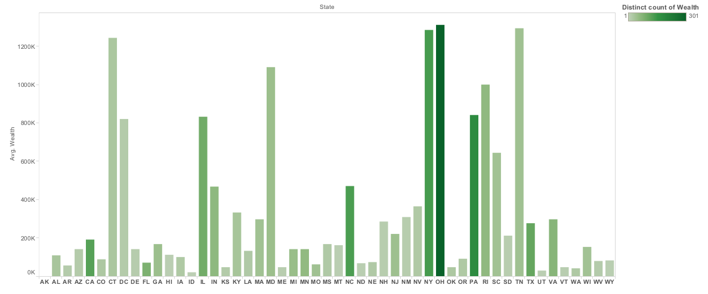 
Sum of Wealth for each State. Color shows distinct count of Wealth.
Shelves
Rows:
Wealth
Columns:
State
Filters:
Measure Names
Color:
Distinct count of Wealth
Dimensions
Measure Names has 0 members on this sheet
Members:
State has 51 members on this sheet
Members: MN; NJ; OK; SD; WV; ...
Measures
Distinct count of Wealth ranges from 1 to 301 on this sheet.
Sum of Wealth ranges from 0 to 1,472,214,167 on this sheet.

#####Christian Charities 
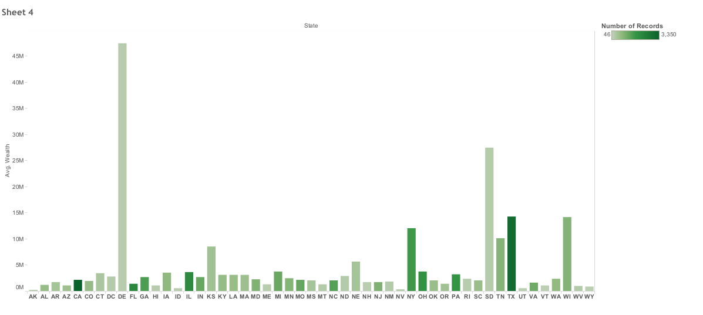 
Average of Income Amt for each State. Color shows sum of Number of Records.
Shelves
Rows:
Avg. Income Amt
Columns:
State
Color:
Sum of Number of Records
Dimensions
State has 51 members on this sheet
Members: AK; MN; OK; SD; WV; ...
Measures
Average of Income Amt ranges from 173,549 to 32,234,166 on this sheet.
Sum of Number of Records ranges from 46 to 3,350 on this sheet.

#####Health Charities 
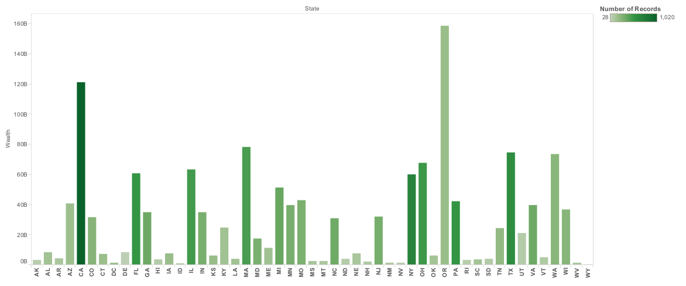 
Average of Wealth for each State. Color shows sum of Wealth.
Axies: 
Rows:
Avg. Wealth
Columns:
State
Color:
Sum of Wealth
Dimensions:
State has 51 members on this sheet
Members: MN; NJ; OK; SD; WV; ...
Measures:
Average of Wealth ranges from 6,385,510 to 927,687,298 on this sheet.
Sum of Wealth ranges from 249,034,882 to 158,634,527,907 on this sheet.

#####Sports Charities 
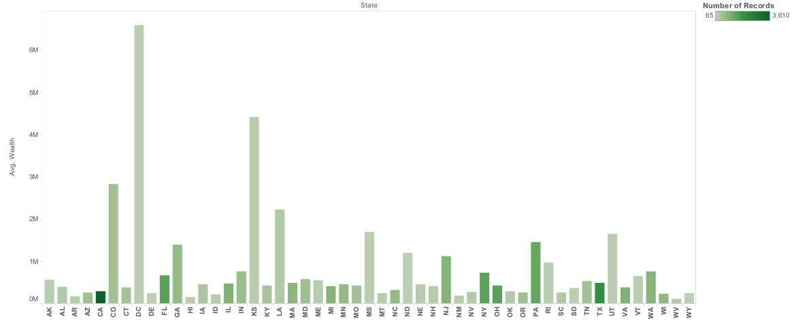
Average of Wealth for each State. Color shows sum of Number of Records.
Shelves
Rows:
Avg. Wealth
Columns:
State
Color:
Sum of Number of Records
Dimensions
State has 51 members on this sheet
Members: AK; MN; OK; SD; WV; ...
Measures
Average of Wealth ranges from 104,281 to 6,583,167 on this sheet.
Sum of Number of Records ranges from 65 to 3,610 on this sheet.

###Oracle Data Miner

#####Children Charities 

######Workflow
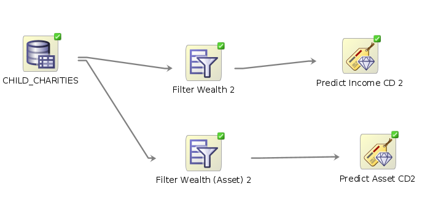 

######Lifts
######Asset Code Prediction
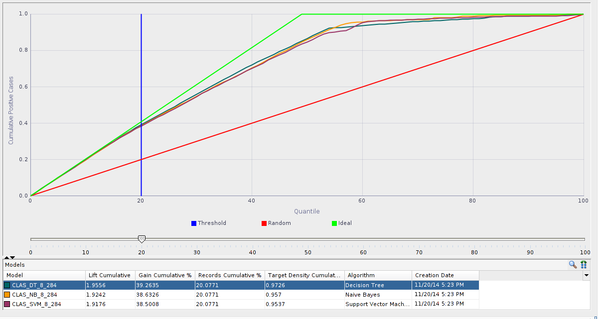 

######Income Code Prediction
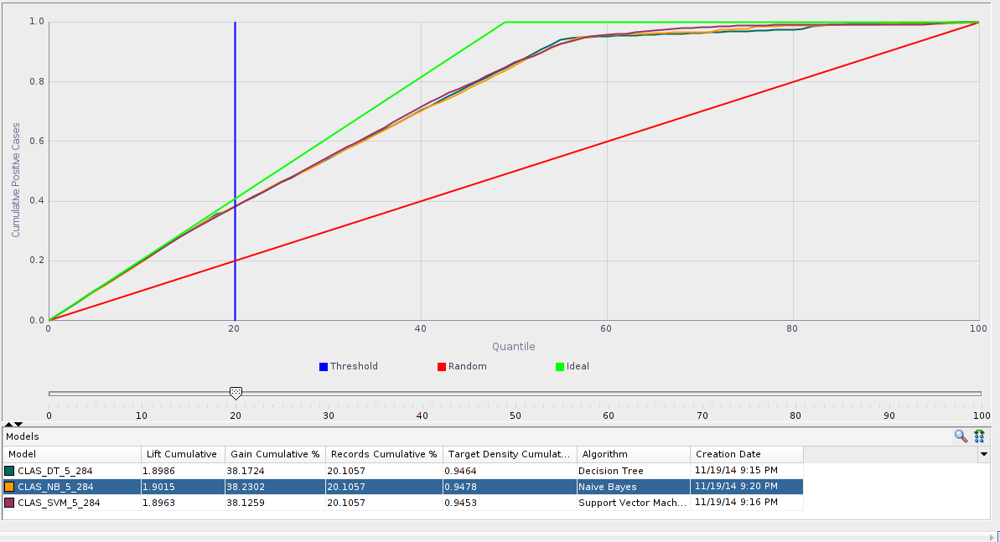 

#####Church Charities 

######Workflow
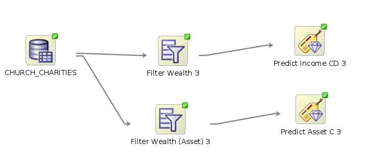 

######Lifts
######Asset Code Prediction
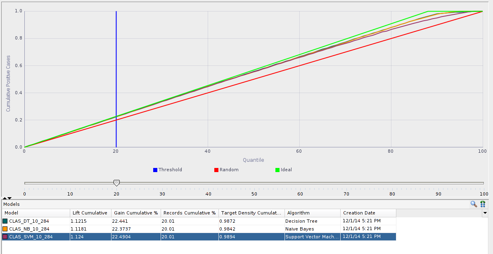 

######Income Code Prediction
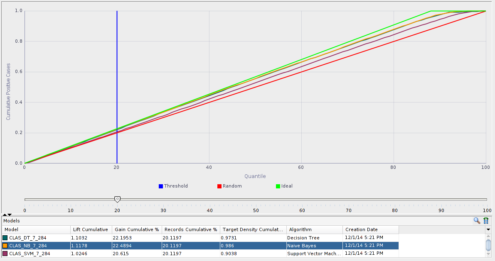 

#####Christian Charities 

######Workflow
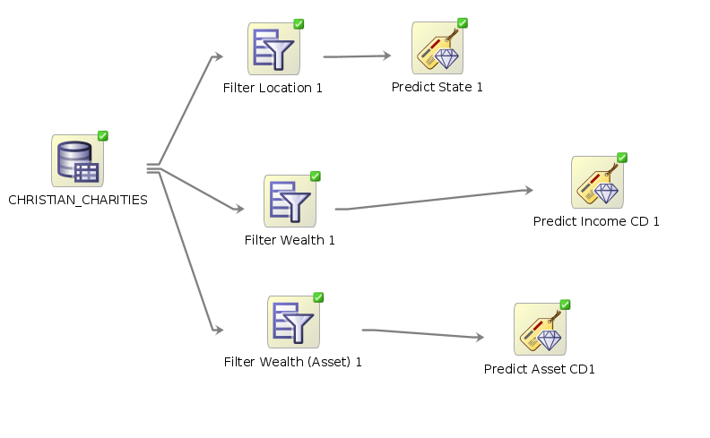 

######Lifts
######Asset Code Prediction
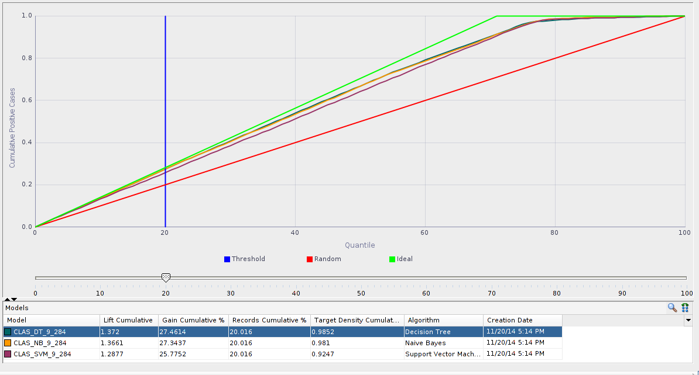 

######Income Code Prediction
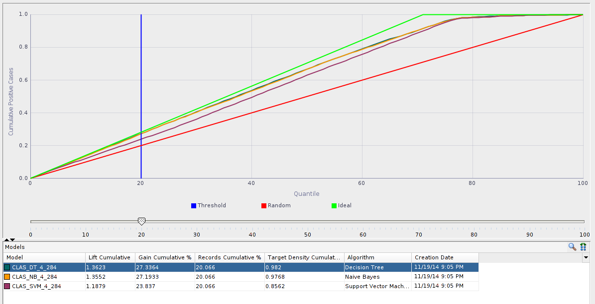 

#####Health Charities 

######Workflow
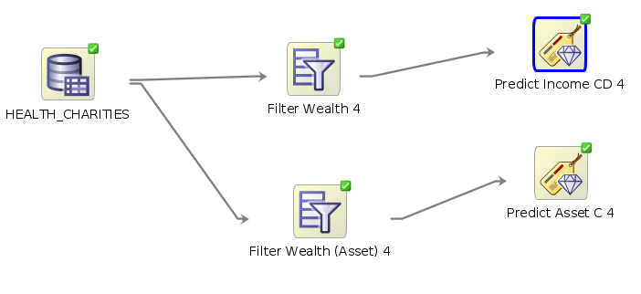 

######Lifts
######Asset Code Prediction
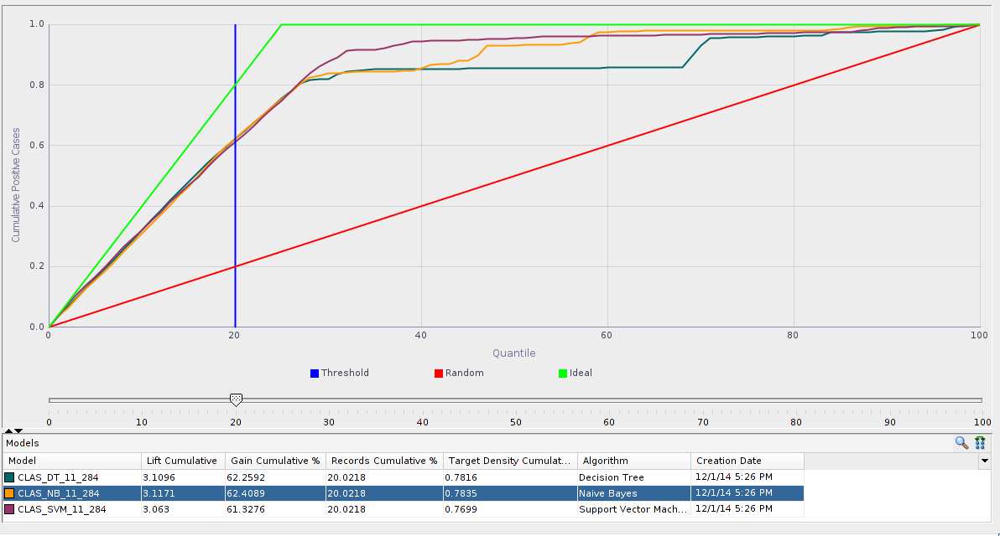 

######Income Code Prediction
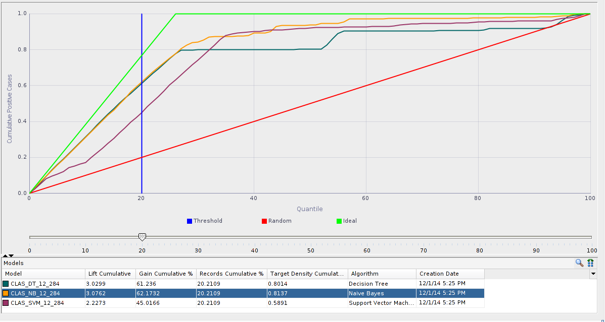  

#####Sports Charities 

######Workflow
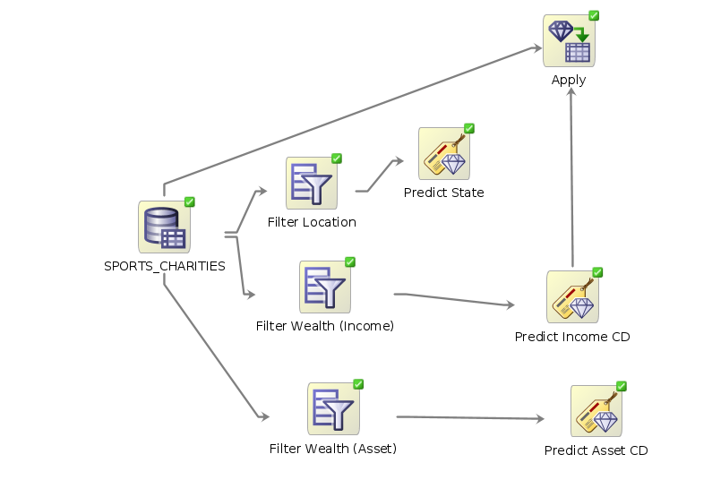 

######Lifts
######Asset Code Prediction
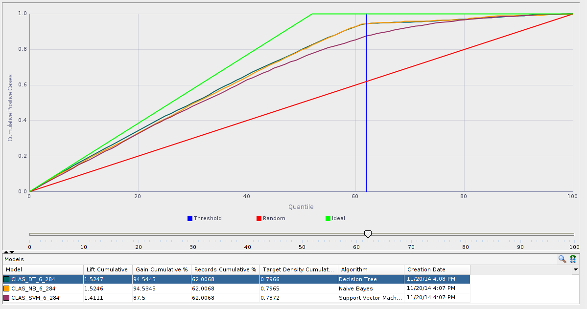 

######Income Code Prediction
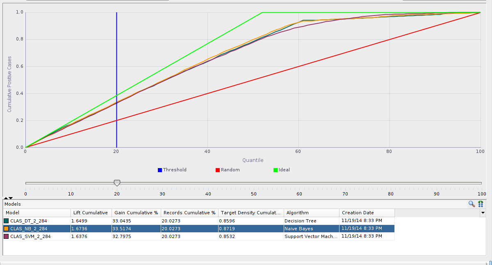 

